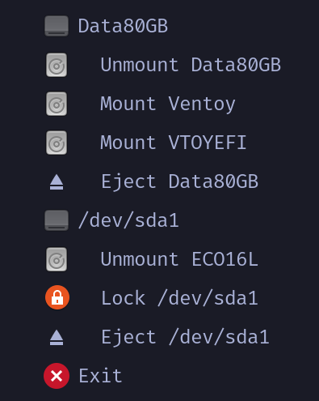

# riskie



A simple, opinionated disk automounting daemon for Linux written in Rust.

## Overview

riskie is a Rust implementation of udiskie, designed to be simpler and more opinionated. It automatically mounts removable devices and provides a system tray interface for easy management.

### Features

- ✅ Automount removable devices to `/run/media/$USER`
- ✅ System tray interface (ksni) - works on X11 and Wayland
- ✅ D-Bus integration with udisks2
- ✅ Desktop notifications on mount/unmount events
- ✅ Mount/unmount/eject from tray menu
- ✅ Multi-language support (English, Spanish)
- ✅ Target: i3, Hyprland, Sway (minimal window managers)

### Difference from udiskie

- **Simpler UX**: Single-click mount/unmount from tray (no cascading menus)
- **Opinionated defaults**:
  - Automount ALL removable devices
  - Mount to `/run/media/$USER/{label}` (FHS-compliant)
  - No LUKS support (keeps it simple)
- **Daemon-only mode**: No one-shot mode, designed to run as a background service
- **Modern Rust**: Better performance, smaller binary, async-first design
- **Internationalization**: Built-in i18n support with gettext

## Installation

### Arch Linux (AUR)

```bash
# Using yay
yay -S riskie

# Using paru
paru -S riskie

# Enable autostart
systemctl --user enable --now riskie.service
```

### From Source

```bash
git clone https://github.com/ecruzolivera/riskie.git
cd riskie
cargo build --release
```

The binary will be at `target/release/riskie`.

**Build Requirements:**
- Rust toolchain (cargo, rustc)
- gettext (for compiling translations)

### Pre-built Binaries

Download from [GitHub Releases](https://github.com/ecruzolivera/riskie/releases).

### System-wide Installation

```bash
sudo install -m 755 target/release/riskie /usr/local/bin/

# Install translations
for po in po/*.po; do
    lang=$(basename "$po" .po)
    install -Dm644 "$po" "/usr/share/locale/$lang/LC_MESSAGES/riskie.mo"
done

# Install systemd service
install -Dm644 contrib/systemd/riskie.service /usr/lib/systemd/user/
```

### Dependencies

**Runtime:**
- **udisks2**: Must be running (standard on most Linux distributions)
- **D-Bus**: Required for communication with udisks2
- **gettext**: For loading translations at runtime
- **System tray**: One of:
  - i3bar/Swaybar with tray support
  - Waybar
  - eww
  - Any StatusNotifierItem-compatible tray

## Usage

### Running Directly

```bash
# Run the daemon
riskie

# With verbose logging
RUST_LOG=info riskie
```

### Systemd Service (Recommended)

1. Install the service file:

```bash
# If installed from AUR, service is already installed
# For manual installation:
install -Dm644 contrib/systemd/riskie.service ~/.config/systemd/user/
```

2. Enable and start:

```bash
systemctl --user enable --now riskie
```

3. Check status:

```bash
systemctl --user status riskie
```

4. View logs:

```bash
journalctl --user -u riskie -f
```

## System Tray Usage

- **Left or Right click** on the tray icon to open the menu
- Each drive shows as a header with mount/unmount actions
- Click **Mount** to mount an unmounted partition
- Click **Unmount** to unmount a mounted partition
- Click **Eject** to safely remove the entire drive (unmounts all partitions)
- Click **Exit** to quit the daemon

## Desktop Notifications

riskie sends desktop notifications for:

- Device connected
- Mount success/failure
- Unmount success/failure

If unmount fails because the device is busy, the notification will suggest closing open files.

## Localization

riskie supports multiple languages using gettext. Translations are loaded from `/usr/share/locale/{lang}/LC_MESSAGES/riskie.mo`.

### Supported Languages

- English (default)
- Spanish (es)

### Adding a Translation

1. Copy the template:

   ```bash
   cp po/riskie.pot po/{lang}.po
   ```

2. Edit the `.po` file with your translations

3. Build and install:
   ```bash
   msgfmt po/{lang}.po -o {lang}.mo
   sudo install -Dm644 {lang}.mo /usr/share/locale/{lang}/LC_MESSAGES/riskie.mo
   ```

## Configuration

Currently, riskie is opinionated and does not support configuration files. All behavior is hardcoded:

- **Mount points**: `/run/media/$USER/{device_label}` (handled by udisks2)
- **Auto-mount**: Enabled by default for all removable devices
- **Notifications**:Enabled by default

## Development Status

- **Phase 1: Core D-Bus Integration** - ✅ COMPLETE
- **Phase 2: Device Management** - ✅ COMPLETE
- **Phase 3: System Tray** - ✅ COMPLETE
- **Phase 4: Error Handling & Polish** - ✅ COMPLETE
- **Phase 5: Testing & Documentation** - ✅ COMPLETE
- **Phase 6: Packaging & i18n** - ✅ COMPLETE

## Architecture

```
riskie daemon
├── D-Bus client (zbus)
│   ├── Connect to udisks2
│   ├── Listen for InterfacesAdded/Removed signals
│   └── Query Block/Filesystem interfaces
├── Device Manager
│   ├── Track devices in Vec<Device>
│   ├── Automount on device addition
│   └── Cleanup on device removal
├── SystemTray (ksni)
│   ├── Show icon in system tray
│   ├── Menu: List devices with mount/unmount/eject actions
│   └── Update menu dynamically
├── Notifications (notify-rust)
│   ├── Device connected
│   ├── Mount success/failure
│   └── Unmount success/failure
├── i18n (gettext-rs)
│   ├── Load translations from /usr/share/locale
│   └── Translate UI strings
└── Mount Point Manager
    ├── Call udisks2 Mount() method
    └── Call udisks2 Unmount() method
```

## Dependencies

- `zbus` - D-Bus bindings for Rust
- `ksni` - StatusNotifierItem implementation (system tray)
- `notify-rust` - Desktop notifications
- `gettext-rs` - Internationalization
- `tokio` - Async runtime
- `tracing` - Logging and tracing
- `anyhow` - Error handling

## License

MIT License - see [LICENSE](LICENSE)

## Acknowledgments

Inspired by [udiskie](https://github.com/coldfix/udiskie) by coldfix.
